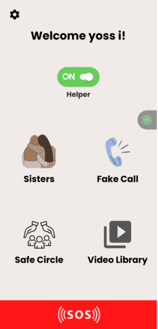
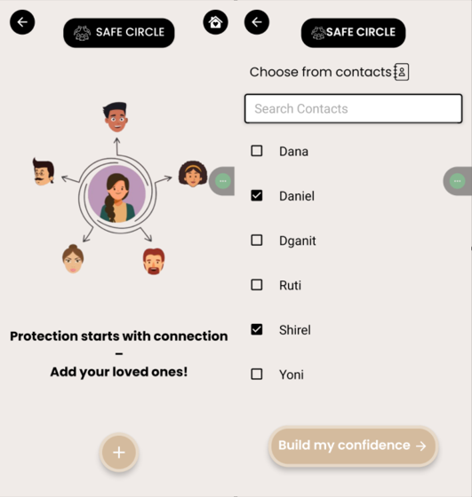
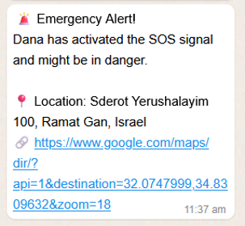
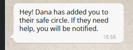
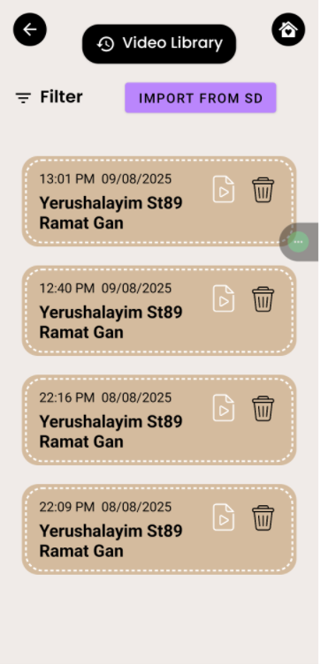
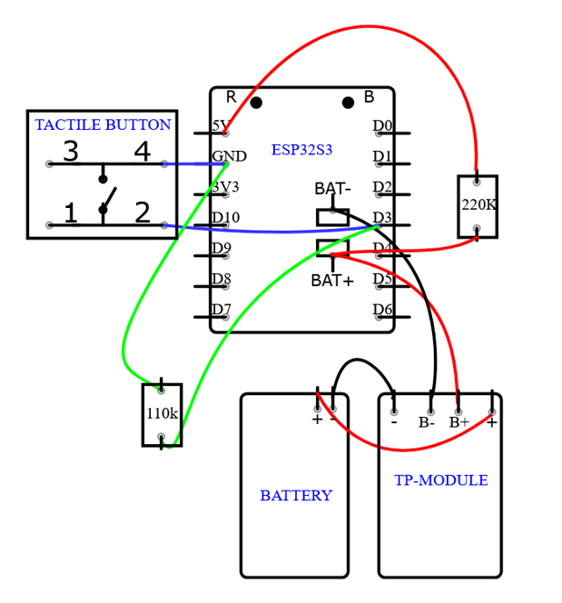

# SafeHer

A personal safety device that pairs a wearable pendant with an Android app: one button press sends your live location and a video clip to trusted contacts via WhatsApp.

Built as a 4-person capstone project for our CS bachelor's degree.
<p align="center">    </p>

## What it does

1. User presses the SOS button on the pendant.
2. The pendant (Xiao Seeed ESP32S3) captures a short low-light video clip.
3. The phone app attaches the user's live GPS coordinates.
4. A WhatsApp alert with location and video is sent to the user's trusted contacts (their "Safe Circle") via the Twilio API.

<p align="center">
  
</p>

Captured video clips are timestamped and stored in-app for later review:

<p align="center">
  
</p>

## My role

I was one of four contributors. I focused on:
- Backend (Node.js/TypeScript, MongoDB) — emergency contact storage, GPS handling, and the Twilio/WhatsApp alert pipeline
- Camera integration on the ESP32S3 (C++ in Arduino IDE) — capturing and transmitting video from the pendant
- Contributed to the Android frontend (Kotlin) alongside teammates

The pendant hardware itself — soldering the battery/button and the 3D-printed housing — was a team effort with outside help for the soldering.

## Architecture

**Hardware**
- Xiao Seeed ESP32S3 camera module, programmed in C++ via Arduino IDE
- SOS push button, soldered onto the board, with a TP4056 charging module and battery
- 3D-printed pendant housing

<p align="center">
  
</p>

**Backend** (`/backend`)
- Node.js + TypeScript
- MongoDB for contacts and event data
- Twilio API for WhatsApp alert delivery
- GPS coordinate handling

**Frontend** (`/frontend`)
- Kotlin, Android Studio
- Emergency contact configuration
- Live location tracking during an active alert
- Alert history / status view

## Tech stack

| Layer | Tech |
|---|---|
| Hardware | ESP32S3, C++ (Arduino IDE) |
| Backend | Node.js, TypeScript, MongoDB, Twilio API |
| Frontend | Kotlin, Android SDK |

## Project structure

```
SafeHer/
├── backend/          # Node.js + TypeScript backend
├── frontend/          # Kotlin Android app
├── firmware/          # ESP32S3 C++ (Arduino) code
└── README.md
```

## Status

Built and demoed as a capstone project. The SOS → video capture → location → WhatsApp alert flow was tested end-to-end on the working prototype (see screenshots above). Not actively maintained post-graduation.
